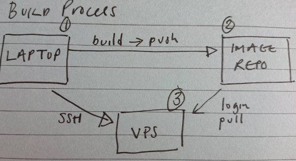

# Ngnix docker .net apps basic demo

- Just a demo as to how I might approach something like what you are after
- Using digital ocean vps for demo purposes
- Dockerhub for the images

## Outline and assumptions

- Assumes we are using a hosted database for all the apps
- App code is deliberately trivial no dependencies
- Containers. Basic approach - each app is a two stage build - Build stage and runtime stage to reduce size etc..

## Basic publish update procedure per app...

Likely automated with a shell script or a build process using github actions or somesuch ...

### Build process - per app

1. Build image
2. Push the image to a registry
3. SHH into the VPS
4. Login to the Registry from the VPS
5. Pull the image from the Registry
6. Stop and remove the old container
7. Run new container with the updated image

# Notes

#### Bash into container

docker exec -it <container_hash> bash

#### Ngnix reverse proxy with a series of containerised apps behind it

https://www.digitalocean.com/community/tutorials/how-to-configure-nginx-as-a-reverse-proxy-on-ubuntu-22-04
